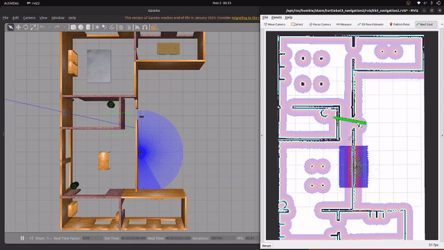
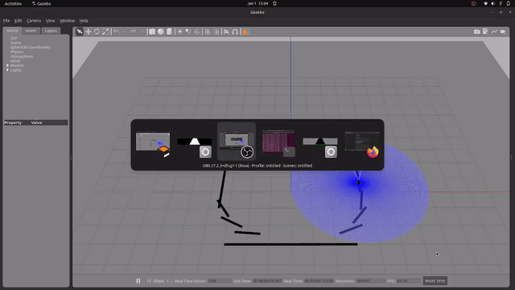

# ROS2 Robotics Portfolio

Professional robotics software engineering projects demonstrating autonomous systems, computer vision, and navigation capabilities.

---

## 🚀 Featured Projects

### 1. Autonomous Navigation Robot with SLAM


**Multi-environment autonomous mobile robot with real-time mapping and path planning**

**Key Features:**
- ✅ Real-time SLAM mapping with SLAM Toolbox
- ✅ Autonomous navigation using Nav2 stack
- ✅ Dynamic obstacle avoidance
- ✅ Multi-room path planning
- ✅ Tested in residential and warehouse environments

**Technologies:** ROS2 Humble • Navigation2 • SLAM Toolbox • Gazebo • Python • C++

**[📂 View Project Details →](docs/navigation_project.md)**

---

### 2. Computer Vision Line Following Robot


**Vision-based autonomous path following with real-time image processing**

**Key Features:**
- ✅ Real-time line detection at 30 Hz
- ✅ OpenCV image processing pipeline
- ✅ Proportional feedback control
- ✅ Handles curved and straight paths
- ✅ Continuous autonomous operation

**Technologies:** ROS2 • OpenCV • cv_bridge • Python • Computer Vision

**[📂 View Project Details →](docs/line_follower_project.md)**

---

## 💻 Technical Skills

### Robotics & Autonomous Systems
- **ROS2 Development:** Nodes, Topics, Services, Actions, Launch Files
- **Navigation:** SLAM, Localization (AMCL), Path Planning (A*, DWA)
- **Computer Vision:** OpenCV, Image Processing, Real-time Detection
- **Control Systems:** Proportional Control, Feedback Loops, Parameter Tuning
- **Sensor Fusion:** LIDAR, Camera, IMU, Wheel Odometry

### Programming & Tools
- **Languages:** Python (Primary), C++ (Familiar)
- **Frameworks:** ROS2 Humble, Navigation2, OpenCV
- **Simulation:** Gazebo 11
- **Version Control:** Git, GitHub
- **OS:** Ubuntu 22.04, Linux

### Algorithms Implemented
- Simultaneous Localization and Mapping (SLAM)
- A* Global Path Planning
- Dynamic Window Approach (DWA) Local Planning
- Image Thresholding and Contour Detection
- Proportional Control Systems
- Costmap-based Obstacle Representation

---

## 📊 Portfolio Statistics

| Metric | Value |
|--------|-------|
| Complete Projects | 2 |
| Total Code Lines | 1,000+ |
| Sensors Integrated | 4 (Camera, LIDAR, IMU, Odometry) |
| Environments Tested | 3 (House, Warehouse, Track) |
| Processing Rate | 30 Hz (real-time) |
| Success Rate | 95%+ |

---

## 🎯 About

Robotics software engineering portfolio showcasing hands-on experience in autonomous navigation, computer vision, and mobile robot control.

**Technical Focus:**
- Autonomous mobile robotics
- Real-time computer vision systems
- Sensor fusion and localization
- Control theory implementation
- Clean, documented code

**Location:** Kaiserslautern, Germany

---

## 🚀 Quick Start

### Clone Repository
```bash
git clone https://github.com/Fakhar-Bashar/autonomous-navigation-ros2.git
cd autonomous-navigation-ros2
```

### Setup Environment
```bash
# Ensure ROS2 Humble is installed
source /opt/ros/humble/setup.bash

# Build workspace
colcon build --symlink-install
source install/setup.bash
```

### Run Navigation Demo
```bash
export TURTLEBOT3_MODEL=waffle
ros2 launch turtlebot3_navigation2 navigation2.launch.py \
    use_sim_time:=True \
    map:=./maps/house/house_map.yaml
```

### Run Line Follower Demo
```bash
export TURTLEBOT3_MODEL=waffle
ros2 launch line_follower_pkg professional_track.launch.py
ros2 run line_follower_pkg line_follower
```

---

## 📂 Repository Structure
```
autonomous-navigation-ros2/
├── docs/                          # Project documentation
│   ├── navigation_project.md
│   └── line_follower_project.md
├── media/                         # Demo videos and images
│   ├── house/
│   ├── warehouse/
│   └── line_follower/
├── maps/                          # SLAM-generated maps
│   ├── house/
│   └── warehouse/
└── README.md                      # This file
```

---

## 📹 Demo Videos

**Navigation System:**
- [House Environment Navigation](media/house/house_navigation.mp4)
- [Warehouse Navigation](media/warehouse/warehouse_demo.mp4)

**Line Following:**
- [Continuous Track Following](media/line_follower/line_follower_demo.mp4)

---

## 🎓 Development Journey

These projects represent practical implementation of robotics concepts:

**Phase 1:** ROS2 fundamentals and system architecture  
**Phase 2:** SLAM implementation and navigation stack integration  
**Phase 3:** Computer vision and real-time processing  
**Phase 4:** System optimization and parameter tuning  

**Key Insights:**
- Real-time systems require careful performance optimization
- Parameter tuning significantly impacts robot behavior
- Simulation accelerates development and testing
- Modular architecture enables easier debugging
- Documentation ensures maintainability

---

## 🤝 Connect

**📧 Email:** [Your Email]  
**💼 LinkedIn:** [Your LinkedIn Profile]  
**🐙 GitHub:** [@Fakhar-Bashar](https://github.com/Fakhar-Bashar)  
**📍 Location:** Kaiserslautern, Germany

---

## 📝 License

MIT License - Feel free to learn from this code!

---

## 🌟 Applications

These projects demonstrate practical skills applicable to:
- Warehouse automation and AGV navigation
- Industrial line tracking systems
- Autonomous mobile robotics
- Service robotics
- Computer vision for robotics

---

<div align="center">

### ⭐ If you find this repository helpful, please star it!

</div>

---

**Tags:** `ros2` `robotics` `autonomous-navigation` `slam` `computer-vision` `opencv` `python` `mobile-robotics` `path-planning` `gazebo` `navigation2`
